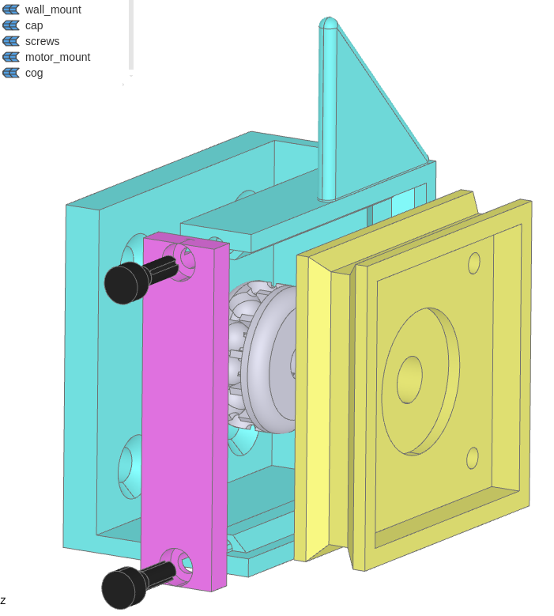

# blind_controller

## 3D printed parts to attach to blind pull chain

[blind_controller.py](hardware/projects/blind_controller.py)

* Chains vary so constants `ball_chain_d` and `ball_chain_step` may need to be changed. Experimentation likely required due to print tolerances
* The total diameter of the cog `ball_chain_cog_d` can be varied, higher seems to be easier to print (at least for my printer) but lower will give higher torque
* Everything can be printed without support in the orientation the parts are exported in but the 45 degree fin will end up pretty rough - can either support it or clean it up after. Can also remove it if the blind doesn't hit the motor mount

## Rust firmware

[blind.rs](src/bin/blind.rs)

* `BLIND_HEIGHT` is measured in steps so it's easiest to determine experimentally - raise the blind up manually then navigate to `<ESP_IP>/backward/<n>` where `n` is a number of steps (100 is about an inch in my setup) and refresh until the blind reaches the bottom, keeping track of the total
* [bootstrap](scripts/bootstrap) contains the commands to install the xtensa toolchain

## Wiring

* I'm using a TMC2208 wired to an ESP32 as follows
    * step = GPIO32
    * dir = GPIO33
    * en = GPIO25
    * ms1 = GPIO27
    * ms2 = GPIO26
* It's only been tested with an xtensa esp32 but it should work with anything supported by [esp-hal](https://github.com/esp-rs/esp-hal) with minor modifications (look at [run](scripts/run) and [xstensa_blind-run](scripts/run) for the features & targets needed)
* I'm using a USB-PD trigger to provide 12v to the stepper driver + a 12v to 3.3v dcdc to provide the 3.3v to the ESP and stepper driver IO. PD can provide more than enough power to run a stepper at the max continuous current supported by the TMC2208 - your milage may vary if you use a more powerful driver.

## TODO:

1. NTP time sync so the esp can automate raising and lowering without being prompted over http
1. OTA flashing (started [ota_build](scripts/ota_build) but not sure there's a non-idf OTA crate currently)
1. Hardware stepping - currently the step line is being bit banged with embassy sleeps in between. It works ok but it's rough, not very accurate and leaving a chunk of speed on the table. The RMT peripheral can be configured with acceleration sequences and can run the whole step sequence in hardware.

## License

Free and open source software distributed under the terms of both the [MIT License][lm] and the [Apache License 2.0][la].

[lm]: LICENSE-MIT
[la]: LICENSE-APACHE
